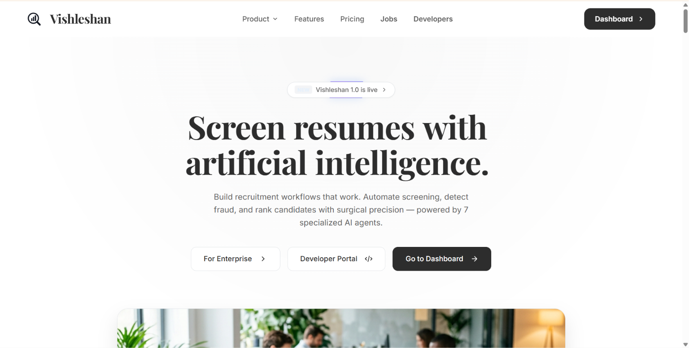
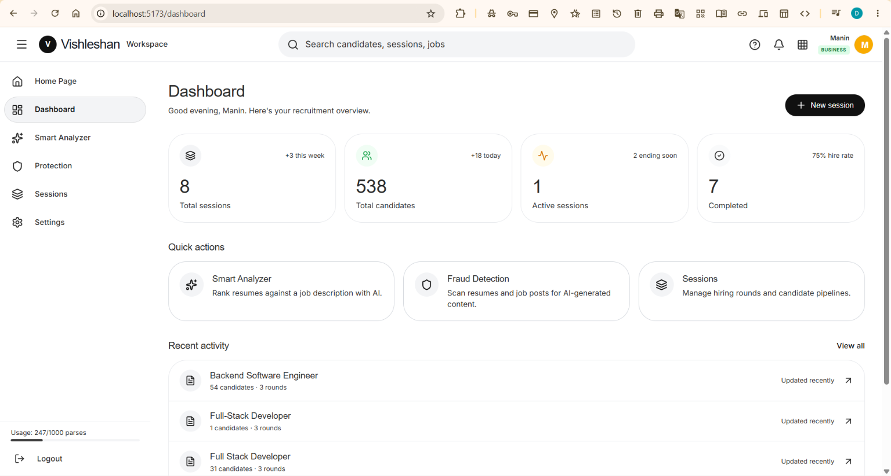
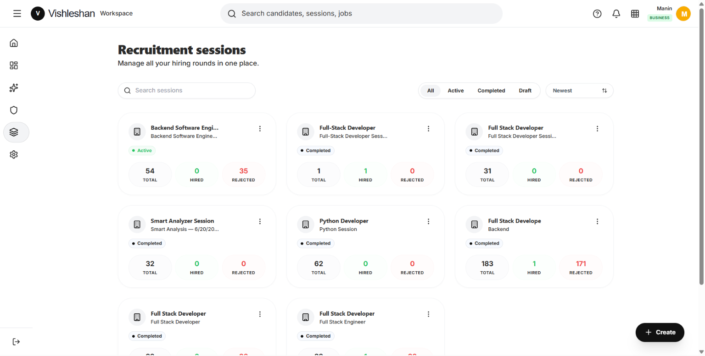
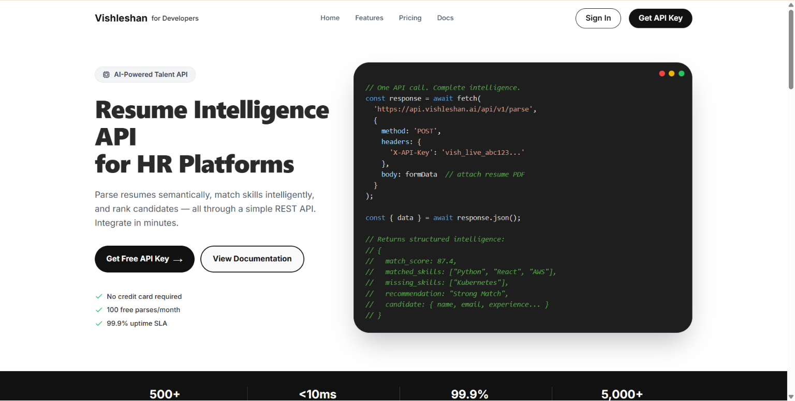

<div align="center">
  

  <h1 align="center">Vishleshan — Multi-Agent Recruitment Intelligence Platform</h1>

  <p align="center">
    <strong>A multi-agent AI system for semantic resume parsing, candidate matching, fraud detection, and recruitment automation — built for enterprise HR teams and developer integrations.</strong>
  </p>

  <p align="center">
    <a href="#architecture">Architecture</a> •
    <a href="#multi-agent-system">Agents</a> •
    <a href="#features">Features</a> •
    <a href="#quick-start">Quick Start</a> •
    <a href="#developer-portal">Developer Portal</a> •
    <a href="#api-reference">API Reference</a> •
    <a href="#license--attributions">License</a>
  </p>
</div>

---

## Overview

**Vishleshan** is a production-grade, multi-agent AI platform that automates the entire recruitment pipeline — from resume ingestion and skill extraction to candidate ranking, AI-powered interviews, and fraud detection. It uses a coordinated system of specialized LLM agents, vector databases, and asynchronous workers to transform unstructured documents into actionable intelligence.

The platform serves three distinct user groups:
- **Recruiters** — A full-featured Applicant Tracking System (ATS) with AI screening, matching, and analytics
- **Job Seekers** — A job discovery portal with safety verification and legitimacy checks
- **Developers** — A SaaS API portal with subscription billing, rate limiting, and usage dashboards

---

## Multi-Agent System

Vishleshan's core intelligence is powered by a coordinated system of **7 specialized AI agents**, each responsible for a distinct task in the recruitment pipeline:

| Agent | File | Responsibility |
|-------|------|---------------|
| **Resume Parsing Agent** | `agents/parsing_agent.py` | Extracts structured data (skills, experience, education, projects) from PDF/DOCX/TXT files using LLM-guided extraction |
| **Skill Normalization Agent** | `agents/normalization_agent.py` | Maps raw extracted skills to a canonical taxonomy of 1,000+ technical and soft skills with synonym resolution |
| **Matching Agent** | `agents/matching_agent.py` | Computes semantic match scores between candidate profiles and job descriptions using vector similarity and weighted criteria |
| **Inference Agent** | `agents/inference_agent.py` | Infers missing candidate attributes (seniority level, role category, domain expertise) from available resume data |
| **AI Chatbot Agent** | `agents/chatbot_agent.py` | Powers natural language candidate queries — ask questions like "Find Python developers with 3+ years in fintech" |
| **Fraud Detection Agent** | `agents/fraud_agent.py` | Scans resumes and job postings for plagiarism, AI-generated content, ATS keyword stuffing, and phishing patterns |
| **LLM Router** | `agents/llm.py` | Manages API key rotation across multiple Gemini keys with automatic failover, rate-limit recovery, and load balancing |

All agents communicate through the `RotateLLMClient`, which distributes requests across a pool of API keys and automatically handles quota exhaustion, retries, and model selection.

---

## Features

### Recruiter Dashboard (ATS)
- **Batch Resume Upload** — Drag-and-drop PDF/DOCX files with async Celery processing
- **AI Skill Extraction** — Multi-agent pipeline extracts skills, experience, contact details, and projects
- **Semantic Job Matching** — Vector-based scoring against job descriptions with configurable skill weights
- **AI Chatbot** — Query your candidate pool in natural language
- **Session Management** — Multi-round hiring workflows with configurable evaluation criteria
- **Gmail & Google Drive Sync** — Import resumes directly from email attachments and cloud folders
- **Company Settings** — Upload company logos, configure branding, and manage team profiles
- **Analytics Dashboard** — Hiring velocity, pipeline health, and candidate quality metrics

### Fraud Detection & Protection
- **Resume Authenticity Scanning** — Detects AI-generated content, plagiarism, and invisible keyword stuffing
- **Job Posting Verification** — Flags phishing scams, ghost job indicators, and clone copy-paste listings
- **AI Fake Job Detection System (Module 1)** — Fully integrated 6-point verification checklist to protect job seekers:
  1. *Official Website Validation* (Presence of corporate domain and security certificates)
  2. *Recruiter Email Domain Verification* (Matches registered corporate domain; flags generic public accounts)
  3. *Salary Realism Evaluation* (Assesses compensation ranges against local market standards)
  4. *LinkedIn Company Presence Check* (Lookup on professional networking platforms)
  5. *Suspicious/Copied Description Analysis* (Identifies boilerplate scam templates and high copy signatures)
  6. *Duplicate/Repeated Posting Detection* (Scans mass automation patterns in public listings)
- **Legitimacy Score Output Suite** — Real-time Trust Score (/100), Risk Level (Low/Medium/High), Verified Company status, and Approved/Suspicious classification for every scan
- **Scan History** — Recruiter & Job Seeker audit trail of all safety checks with dynamic interactive breakdowns

### Job Seeker Portal
- **Dedicated Seeker Accounts** — Separate login and registration flows for job seekers, redirecting directly to `/jobs` as the unified landing hub & dashboard.
- **AI Resume Builder & Editor** — Create, edit, and export resumes using 7 professional, high-fidelity templates (Modern, Classic, Minimal, Executive, Creative, Compact, ATS Optimized).
- **High-Fidelity Actual Template Previews** — Replaced all generic/AI-generated placeholder preview cards in the template gallery with exact, high-quality rendered images matching the actual template structures and styling.
- **Dynamic Columns Selector** — Seamlessly toggle between 1-column and 2-column layouts on any template with automatic sections splitting/collapsing.
- **ReportLab 2-Column PDF Exporter** — Backend PDF generator utilizing height-based wrapping and dummy canvas measurements to dynamically paginate 2-column documents across multiple pages without overflow.
- **Active Profile Details Auto-Sync** — Setting a resume draft as the "Active Resume" automatically extracts and syncs experience, education, projects, skills, certifications, and languages directly to the seeker profile.
- **Direct Subview Navigation** — Dynamic navbar links (Home, Dashboard, Find Jobs, AI Resume Enhancer, My Applications, Notifications, Market Trends, Hiring Safety) for unified, simplified routing without nested dashboard page overlays.
- **Single-Line Responsive Navbar** — Streamlined layout with Home button to return to the platform landing page (`/`), seeker Dashboard button, and `whitespace-nowrap` layout to ensure smooth mobile-first presentation.
- **Double-Input Job Search** — Search bar supporting both keyword queries and location searches (with Indian city-to-state mapping and live autocomplete suggestions) separated by a clean vertical divider.
- **Real-time Notifications** — In-app notification center and automated email alerts notifying seekers when application status changes (e.g. Shortlisted, Hired)
- **Hiring Safety Checker** — Company domain authenticity scanner; checks scam likelihood and job legitimacy before applying
- **Salary Trends & Analytics** — Interactive charts displaying sector salary growth and high-demand competencies with a global modern blue color palette.
- **Google OAuth Integration** — One-click Google Sign-In & Sign-Up (OAuth 2.0) across all user portals with seamless custom buttons.
- **Cross-Portal Session Sync** — Logging out from the Recruiter/Company dashboard automatically invalidates and terminates sessions across other active Seeker and Developer portal tabs.

### Recruiter & Premium Features
- **Premium Feature Indication** — Shows product design thinking for monetization with a `👑 Premium` plan lock badge on bulk upload (ZIP, PDF, DOCX) buttons.
- **Batch Resume Ingestion** — Mocked and protected under the Premium tier to optimize resource consumption.

### Developer Portal (SaaS API)
- **REST API** — Programmatic access to resume parsing, matching, chatbot, and fraud scanning
- **API Key Management** — Generate, rotate, and revoke production/test keys
- **Subscription Billing** — Razorpay-integrated plans (Free, Starter, Business) with monthly quotas
- **Rate Limiting** — Redis-backed per-key monthly quotas for parse, match, chat, and scan operations
- **Usage Analytics** — Real-time traffic charts, endpoint latency, and monthly usage breakdowns
- **Webhooks** — Configure HTTP callbacks for async parsing completion events
- **Embed Widget** — Generate secure tokens to mount Vishleshan UI in external applications
- **API Documentation** — Interactive playground with request/response examples

---

## Architecture

The platform is built as a monorepo with two primary pillars:

### `backend/` — The AI Engine
- **Framework**: Django 5 + Django REST
- **Database**: PostgreSQL (via Supabase)
- **Cache & Rate Limiting**: Redis
- **Vector Store**: ChromaDB for semantic similarity search
- **Task Queue**: Celery with threaded pool for async resume processing
- **LLM Provider**: Google Gemini (multi-key rotation with automatic failover)
- **Authentication**: JWT tokens (recruiter) + API keys (developer)

### `frontend/` — The React SPA
- **Framework**: React 18 + Vite
- **Styling**: Tailwind CSS
- **State Management**: Zustand
- **Data Fetching**: TanStack React Query
- **Charts**: Recharts
- **Animations**: Framer Motion + GSAP
- **Routing**: React Router v6 with nested layouts

The frontend hosts all three portals (Recruiter ATS, Job Seeker, Developer) as a single SPA with path-based routing:
- `/` — Recruiter landing page
- `/dashboard/*` — Recruiter ATS dashboard
- `/jobs/*` — Job seeker portal
- `/developer/*` — Developer API portal

---

## Platform Highlights

### 1. Interactive Recruiter ATS (Applicant Tracking System)
Complete AI evaluation panels with semantic match scoring, candidate filtering, and multi-round hiring pipelines.

<div align="center">
  
</div>

### 2. Recruiter Recruitment Sessions
Track and manage all hiring rounds, candidates, and job applications in one visual board.

<div align="center">
  
</div>

### 3. Interactive AI Resume Builder & Editor
Build your resume using high-fidelity templates with a real-time side-by-side ATS compatibility score and AI suggestions.

<div align="center">
  
</div>

### 4. Job Seeker Dashboard & ATS Scoring
Track your applications pipeline and review real-time feedback with a breakdown of keywords, skills, formatting, and experience.

<div align="center">
  
</div>

### 5. Developer API Portal (SaaS Dashboard)
Full SaaS portal for third-party integrations with usage analytics, Razorpay subscription billing, and interactive documentation.

<div align="center">
  
</div>

### 6. Job Seeker Landing & Smart Job Discovery
City-aware job search, live state-to-city Indian autocomplete suggestions, and domain safety verification.

<div align="center">
  
</div>

### 7. Market Trends & Salary Insights
Interactive wage trajectories, hiring velocity index, and region-wise job opening distribution charts.

<div align="center">
  
</div>

---

## Quick Start

### One-Click Development Start (Windows)

For Windows environments, you can boot the entire local workspace (Vite Frontend, Django Backend, Redis, and Celery worker) using the provided batch script. It automatically cleans up old ports (`5173` & `8000`), verifies/runs Redis, and spawns the services in separate command windows:

```cmd
run.bat
```

---

### Manual Setup & Requirements

#### 1. Requirements
- Node.js `v18+`
- Python `v3.10+`
- PostgreSQL, Redis, ChromaDB (running locally or remotely)

#### 2. Backend Setup
```bash
cd backend
cp .env.example .env

# Install Python dependencies
pip install -r requirements.txt

# Configure environment variables in .env:
# Set GEMINI_API_KEYS with a comma-separated list of your Gemini API keys
# Set GEMINI_MODEL=gemini-2.5-flash for optimized free tier quota usage
# Set GOOGLE_OAUTH_CLIENT_ID and GOOGLE_OAUTH_CLIENT_SECRET for Google authentication

# Run Database Migrations
python manage.py migrate --fake-initial

# Seed the Skill Taxonomy table (one-time)
python manage.py seed_skills

# Run the Django Dev Server
python manage.py runserver 8000

# Run the Celery Worker (using multi-threaded pool on Windows)
celery -A workers.celery_worker worker --loglevel=info --pool=threads --concurrency=4
```

#### 3. Frontend Setup
```bash
cd frontend
npm install
cp .env.local.example .env.local
# Set NEXT_PUBLIC_API_URL, VITE_GOOGLE_CLIENT_ID, and VITE_GITHUB_CLIENT_ID in .env.local
npm run dev
```

The frontend runs on port `5173` by default and serves all three portals (Recruiter, Job Seeker, Developer) from a single Vite dev server.

---

## API Reference

### Resume Parsing
```bash
curl -X POST "https://api.vishleshan.ai/api/v1/parse" \
  -H "X-API-Key: vish_live_xxxxxxxxxxx" \
  -F "file=@resume.pdf"
```
```json
{
  "success": true,
  "data": {
    "candidate_id": "cnd_9248239a",
    "name": "John Doe",
    "email": "johndoe@email.com",
    "skills": ["Distributed Systems", "Go", "Python"],
    "experience_years": 4.5
  }
}
```

### Fraud Detection Scan
```bash
curl -X POST "https://api.vishleshan.ai/api/v1/protection/scan" \
  -H "X-API-Key: vish_live_xxxxxxxxxxx" \
  -d '{
    "scan_type": "job",
    "job_title": "Senior Frontend Engineer",
    "job_description": "We are looking for a React developer..."
  }'
```
```json
{
  "success": true,
  "data": {
    "job_title": "Senior Frontend Engineer",
    "company_name": "Google",
    "originality_score": 94,
    "ai_probability": 6,
    "plagiarism_score": 5,
    "status": "Approved",
    "risk_level": "Low",
    "verified_company": "Yes",
    "flags": ["Source: LinkedIn"],
    "detailed_checks": {
      "official_website": { "status": "Yes", "details": "Official domain and secure certificates verified." },
      "recruiter_email": { "status": "Yes", "details": "Recruiter email domain matches company domain." },
      "salary_realistic": { "status": "Yes", "details": "Compensation aligns with market standards." },
      "linkedin_presence": { "status": "Yes", "details": "Found active company page on LinkedIn." },
      "description_copied": { "status": "No", "details": "Job requirements are custom-tailored." },
      "repeated_posts": { "status": "No", "details": "No duplicate posting signatures found." }
    },
    "summary": "Verification complete. Job listing appears safe and authentic."
  }
}
```

### Rate Limits by Plan

| Tier | Parses/mo | Match Ops/mo | Chat Queries/mo | Safety Scans/mo |
|------|-----------|-------------|-----------------|-----------------|
| Free | 100 | 50 | 20 | 0 |
| Starter | 1,000 | 500 | 200 | 100 |
| Business | 10,000 | Unlimited | Unlimited | 1,000 |
| Enterprise | Unlimited | Unlimited | Unlimited | Unlimited |

---

## Tech Stack

| Layer | Technology |
|-------|-----------|
| Frontend | React 18, Vite, Tailwind CSS, Zustand, Recharts, Framer Motion, GSAP |
| Backend | Django 5, Celery, PostgreSQL (Supabase), Redis, ChromaDB |
| AI/LLM | Google Gemini (multi-key rotation), Custom multi-agent pipeline |
| Payments | Razorpay |
| Auth | JWT + API Key authentication |
| Deployment | Docker-ready, CI/CD compatible |

---

## Project Structure

```
.
├── backend/
│   ├── agents/            # Multi-agent LLM system (7 agents)
│   ├── api/
│   │   ├── models.py      # Django ORM models
│   │   ├── views/         # REST API endpoints
│   │   │   ├── developer/ # Developer portal APIs
│   │   │   ├── protection.py  # Fraud detection endpoints
│   │   │   ├── sessions.py    # Session management
│   │   │   └── ...
│   │   ├── decorators.py  # Auth & rate limiting
│   │   └── middleware.py  # Usage logging
│   ├── workers/           # Celery async task workers
│   └── requirements.txt
├── frontend/
│   └── src/
│       ├── components/    # Shared UI components
│       ├── pages/
│       │   ├── developer/ # Developer portal pages
│       │   ├── FraudDetectionPage.jsx
│       │   ├── JobSeekerSafetyPage.jsx
│       │   ├── JobsSearchPage.jsx
│       │   └── ...
│       ├── stores/        # Zustand state management
│       └── lib/           # API clients
└── README.md
```

---

## License & Attributions

This project is licensed under the MIT License - see the [LICENSE](LICENSE) file for details.

### Academic Context
**Built as a Sem-IV Project** | *Multi-Agent Recruitment Intelligence Platform*

Engineered for optimal performance, zero-downtime operation, and seamless enterprise integration.